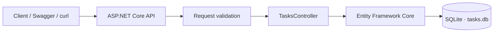
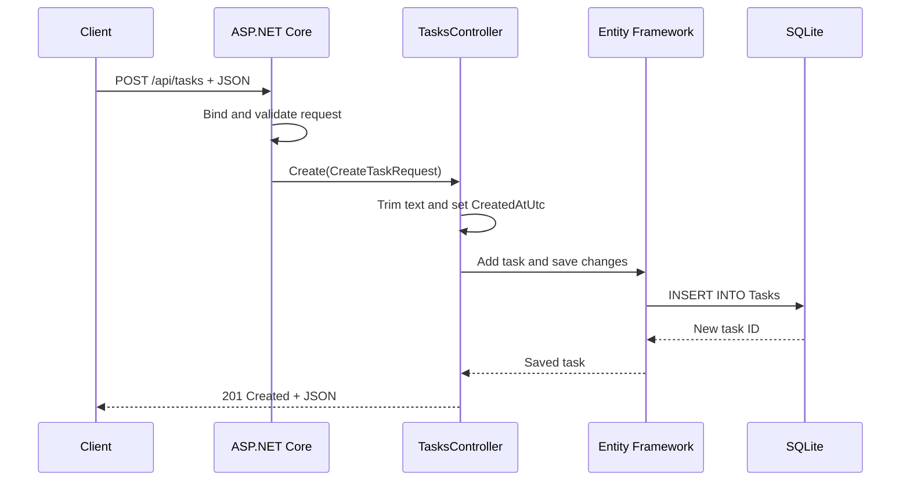

# Task Tracker API (.NET/C#)

[](https://github.com/navinrtnk/taskforge-api/actions/workflows/tests.yml)

A small REST API for creating and managing tasks, built with ASP.NET Core 8,
Entity Framework Core, and SQLite.



The project supports task creation, editing, completion tracking, filtering, summary
statistics, and deletion. Swagger provides an interactive API interface, while the
SQLite database is created automatically on first launch.

## Requirements

- [.NET 8 SDK](https://dotnet.microsoft.com/download/dotnet/8.0)
- A terminal, or an IDE with support for `.http` files

## Get started

Clone the repository, enter its directory, and restore the dependencies:

```shell
dotnet restore
```

Start the API on port `5192`:

```shell
dotnet run --urls http://localhost:5192
```

Then open [http://localhost:5192/swagger](http://localhost:5192/swagger) to explore
and call the endpoints. The local `tasks.db` SQLite database is created automatically.

## How a request is handled



ASP.NET Core handles routing, JSON serialization, and request validation.
`TasksController` contains the application behavior, and Entity Framework Core
translates its LINQ operations into SQLite queries.

## Endpoints

| Method | Route | Purpose |
|---|---|---|
| `GET` | `/api/tasks` | List tasks; optional `?completed=true` filter |
| `GET` | `/api/tasks/stats` | Get total, completed, and open task counts |
| `GET` | `/api/tasks/{id}` | Get one task |
| `POST` | `/api/tasks` | Create a task |
| `PUT` | `/api/tasks/{id}` | Update a task |
| `PATCH` | `/api/tasks/{id}/complete?completed=true` | Set completion |
| `DELETE` | `/api/tasks/{id}` | Delete a task |

Invalid request bodies return `400 Bad Request` with field-specific validation
messages. Mutating a task that does not exist returns `404 Not Found`. The API also
emits structured informational logs when tasks are created, updated, completed, or
deleted; logging levels and providers can be configured through `appsettings.json`.

## Example 1: Create and retrieve a task

Create a task:

```shell
curl -i -X POST http://localhost:5192/api/tasks \
  -H "Content-Type: application/json" \
  -d '{
    "title": "Buy groceries",
    "description": "Milk, bread, and coffee"
  }'
```

The API responds with `201 Created`. The `Location` header points to the new task,
and the body resembles:

```json
{
  "id": 1,
  "title": "Buy groceries",
  "description": "Milk, bread, and coffee",
  "isCompleted": false,
  "createdAtUtc": "2026-08-01T06:30:00Z",
  "updatedAtUtc": null
}
```

Retrieve it using the returned ID:

```shell
curl http://localhost:5192/api/tasks/1
```

## Example 2: Complete a task and view statistics

Mark task `1` complete without replacing its title or description:

```shell
curl -X PATCH "http://localhost:5192/api/tasks/1/complete?completed=true"
```

The response contains the updated task with `isCompleted` set to `true` and an
`updatedAtUtc` timestamp. To see an overview of all tasks, request the statistics:

```shell
curl http://localhost:5192/api/tasks/stats
```

Example response:

```json
{
  "total": 3,
  "completed": 1,
  "open": 2
}
```

You can also list only completed tasks:

```shell
curl "http://localhost:5192/api/tasks?completed=true"
```

## Try requests from an IDE

`TaskTrackerApi.http` contains ready-to-run examples for every CRUD operation.
Open it in Visual Studio, Rider, or another editor with HTTP client support, start
the API, and run each request from the editor.

## Run tests

```shell
dotnet test TaskTrackerApi.Tests/TaskTrackerApi.Tests.csproj
```

The tests cover CRUD behavior, filtering, statistics, validation, normalization,
timestamps, and structured logging. The same suite runs automatically in GitHub
Actions for every push and pull request.

## Project structure

| File | Responsibility |
|---|---|
| `Program.cs` | Configures services, middleware, Swagger, and database creation |
| `TasksController.cs` | Implements the REST endpoints and task behavior |
| `TaskItem.cs` | Defines the persisted task model |
| `TaskRequests.cs` | Defines request validation and the statistics response |
| `TaskDbContext.cs` | Configures Entity Framework and the `Tasks` table |
| `appsettings.json` | Stores the SQLite connection string and logging settings |
| `TaskTrackerApi.http` | Provides executable example HTTP requests |
| `TaskTrackerApi.Tests/` | Contains controller and validation tests |
